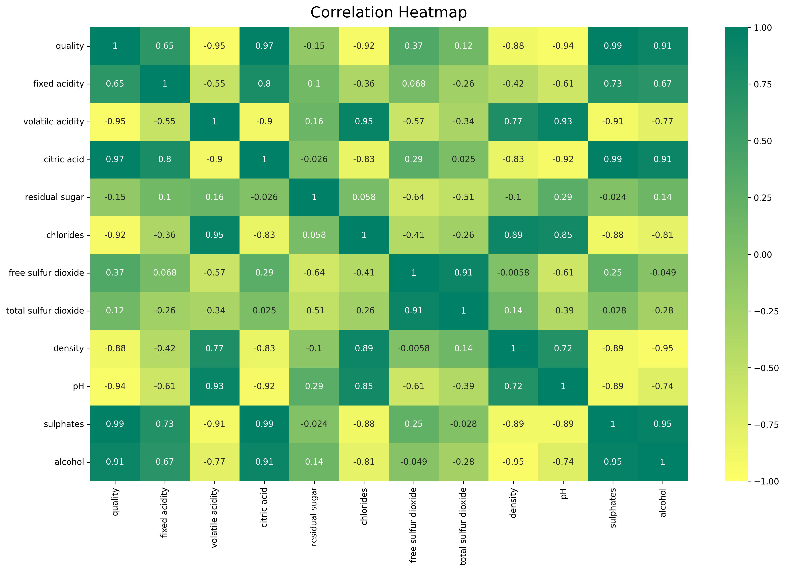

# Wine-Quality EDA and classification 

 ### Data Origin
  
  
 ##### Data was donate by [Paulo Cortez , Department of Information Systems | School of Engineering | University of Minho, Portugal](https://pcortez.dsi.uminho.pt/)     to [Machine Learning Repository](https://archive.ics.uci.edu/ml/datasets/wine+quality) and is being using by [Demetrio Esteban Alférez](https://linkedin.com/in/demstalfer)
 
## [See this notebook in Kaggle!](https://www.kaggle.com/code/demstalfer/wine-eda-preprocessing-and-prediction)

### Data Set Information:

The two datasets are related to red and white variants of the Portuguese "Vinho Verde" wine.  For more details, consult: [Web Link] or the reference [Cortez et al., 2009]. Due to privacy and logistic issues, only physicochemical (inputs) and sensory (the output) variables are available (e.g.  there is no data about grape types, wine brand, wine selling price, etc.).

These datasets can be viewed as classification or regression tasks. The classes are ordered and not balanced (e.g. there are many more normal wines than excellent or poor ones).   Outlier detection algorithms could be used to detect the few excellent or poor wines. Also, we are not sure if all input variables are relevant. So it could be interesting to test feature selection methods.

#### Input variables (based on physicochemical tests):  
1 - fixed acidity  
2 - volatile acidity   
3 - citric acid  
4 - residual sugar  
5 - chlorides  
6 - free sulfur dioxide  
7 - total sulfur dioxide   
8 - density  
9 - pH  
10 - sulphates Output variable (based on sensory data):  
12 - quality (score between 0 and 10)    

## Chemical Correlation example 

### Relevant Papers:

P. Cortez, A. Cerdeira, F. Almeida, T. Matos and J. Reis. Modeling wine preferences by data mining from physicochemical properties.
In Decision Support Systems, Elsevier, 47(4):547-553, 2009.

Available at: [Web Link]

### Citation Request:

P. Cortez, A. Cerdeira, F. Almeida, T. Matos and J. Reis.
Modeling wine preferences by data mining from physicochemical properties. In Decision Support Systems, Elsevier, 47(4):547-553, 2009.

### References :
  - https://archive.ics.uci.edu/ml/datasets/wine+quality

  - http://www3.dsi.uminho.pt/pcortez/

  - https://rpubs.com/Dhivyasri/908195

  - https://towardsdatascience.com/identify-your-datas-distribution-d76062fc0802

  - https://guldenturgay.medium.com/

  - https://www.kaggle.com/code/mnds18/prediction-of-quality-of-wine/notebook

  - https://github.com/demstalferez/SpaceShip
                              
